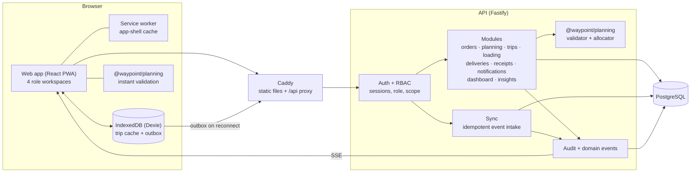
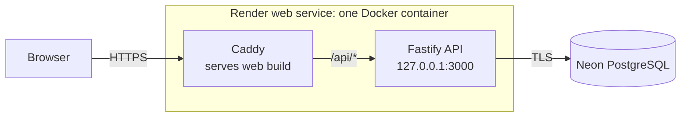

# Architecture

This page describes the system as built. [SYSTEM_DESIGN.md](SYSTEM_DESIGN.md) is the longer design
document written before implementation; where the two differ, this page and the code are correct
(see "Designathon departures" in the [README](../README.md#designathon-departures)).

## System overview

Waypoint is a modular monolith: one web app, one API process and one PostgreSQL database, written
in TypeScript throughout.

| Component | Where | What it does |
| --- | --- | --- |
| Web app (PWA) | `apps/web` | React 18 + Vite. One sign-in page, then a workspace per role: Dispatcher (desktop), Loader (tablet), Driver (phone), Store Manager (desktop and phone). A service worker precaches the app shell. |
| Offline store | `apps/web/src/features/driver/offline` | Dexie (IndexedDB). Caches the driver's trips and holds an outbox of stop events and proof-of-delivery images until they sync. |
| API | `apps/api` | Fastify 5. Each module is `routes.ts` (HTTP and Zod schemas) → `service.ts` (rules and transactions) → `repo.ts` (Drizzle queries). OpenAPI at `/api/docs`. |
| Authentication and RBAC | `apps/api/src/plugins/auth.ts`, `rbac.ts` | Argon2 password hashes, server-side sessions in an httpOnly cookie. `requireRole` guards each route; `scope(user)` adds the user's outlet, depot or vehicle to every query. |
| Planning engine | `packages/planning` | Pure functions with no database or clock access: hard-constraint validator, automatic allocator, order priority, explanations and plan metrics. The API and the browser both import it. |
| Shared contracts | `packages/shared` | Zod schemas, enums, state machines, permissions and error codes used by the web app, the API and the database enums. |
| Database | `packages/database` | Drizzle schema, SQL migrations and a deterministic seed for PostgreSQL 16. |
| Proxy | `infra/Caddyfile*` | Caddy serves the web build and proxies `/api/*` to the API, so the browser sees one origin. |

API modules (`apps/api/src/modules`):

| Module | Responsibility |
| --- | --- |
| `auth` | Sign-in, sign-out, current user |
| `reference` | Outlets, vehicles, depots, calendar, district travel, service allowances (read-only) |
| `orders`, `store` | Order capture, the 16:00 cutoff, the store manager's workspace |
| `planning` | Planning queue, validation, automatic allocation, what-if simulation, deferrals, publish, replan after a vehicle becomes unavailable, saved queue views |
| `trips` | Trips, stops, resequencing, departure |
| `loading` | Start loading, carton counts, loading issues and their acknowledgement, verify, ready |
| `deliveries` | Stop events (arrived, delivered, failed), proof of delivery, ETA |
| `sync` | Batch intake of offline events, idempotency, conflicts, trip deltas |
| `receipts` | Store receipt confirmation, store issues and their resolution |
| `notifications` | In-app feed with read and acknowledge states |
| `dashboard` | Operations summary, exceptions, audit log, live updates over Server-Sent Events |
| `insights` | Demand analytics from order history, outlet profiles |
| `admin` | Demo clock and demo reset; registered only when `DEMO_MODE=true` |
| `health` | Liveness and database readiness |

## Architecture diagram

## Deployment architecture

Hosted (the public URL):

- [render.yaml](../render.yaml) defines one free web service built from
  [infra/single.Dockerfile](../infra/single.Dockerfile). Render terminates HTTPS;
  [infra/single-start.sh](../infra/single-start.sh) starts Caddy and the API in the same container.
- The database is Neon PostgreSQL, reached through `DATABASE_URL`. The container does not run
  migrations: the schema and seed are applied to Neon with `pnpm db:migrate` and `pnpm db:seed`
  from a machine that has the dataset (`pnpm db:seed --reset` replaces an existing seed).
- The container has no dataset files. A dataset seed stores its demo day in the database, so
  "Reset demo data" on the hosted service restores that same day and never falls back to the
  synthetic fixture.
- `DEMO_MODE=true` on the hosted service, so the dispatcher's demo clock and "Reset demo data" work.
  Each clock move is written to the audit log and restored when the API starts, so the free
  service can sleep and restart without putting a published plan back before its own cutoff.

Local (`docker compose up`), from [docker-compose.yml](../docker-compose.yml):

| Service | Image | Starts after | Notes |
| --- | --- | --- | --- |
| `db` | `postgres:16-alpine` | — | Health check `pg_isready`; volume `pgdata` |
| `migrate` | API image | `db` healthy | Runs migrations, then the seed; the seed does nothing if the database is already seeded |
| `api` | `infra/api.Dockerfile` | `migrate` finished | Health check `GET /api/health` |
| `web` | `infra/web.Dockerfile` (Caddy + web build) | `api` healthy | Serves `/`, proxies `/api/*`, on `HTTP_PORT` |

## Main runtime flow

1. **Store order.** The store manager submits an order. At the 16:00 cutoff (operating clock) it
   locks and becomes Confirmed for the next service day.
2. **Planning.** The dispatcher's queue lists confirmed orders and orders deferred by the previous
   run. Automatic allocation, or manual placement, builds draft trips. Every change passes
   `validatePlan`: weight, volume, refrigeration, van-only access, home depot, delivery and mall
   windows, weekly fuel quota and the two-trip limit. Orders that fit nowhere are deferred with a
   reason code.
3. **Publish.** One transaction writes trips, stops, deferrals and the fuel ledger and raises the
   plan version. The loader, the drivers and the stores are notified.
4. **Loading.** The loader sees stops in reverse drop order, counts cartons, and reports shortfalls
   or damage. Ready stays blocked until the dispatcher acknowledges each issue and the load is verified.
5. **Departure and delivery.** The driver starts the trip and records arrival, delivery with
   recipient name and signature (photo optional), or a failed delivery with a reason. Each action
   is written to IndexedDB first, with a client-generated event id.
6. **Sync.** The outbox posts to `POST /api/v1/sync/events`. `stop_events.client_event_id` is
   unique, so a repeated event is answered as `duplicate` and changes nothing. An event for a stop
   that was reassigned meanwhile is stored and raised as a sync conflict.
7. **Receipt.** The store manager sees the status and the proof of delivery, confirms the receipt
   and can report an issue, which the dispatcher resolves.
8. **Audit.** Each service writes an `audit_log` row inside its transaction (actor, role, action,
   before, after). The dispatcher reads an order's full history under Orders & audit.
