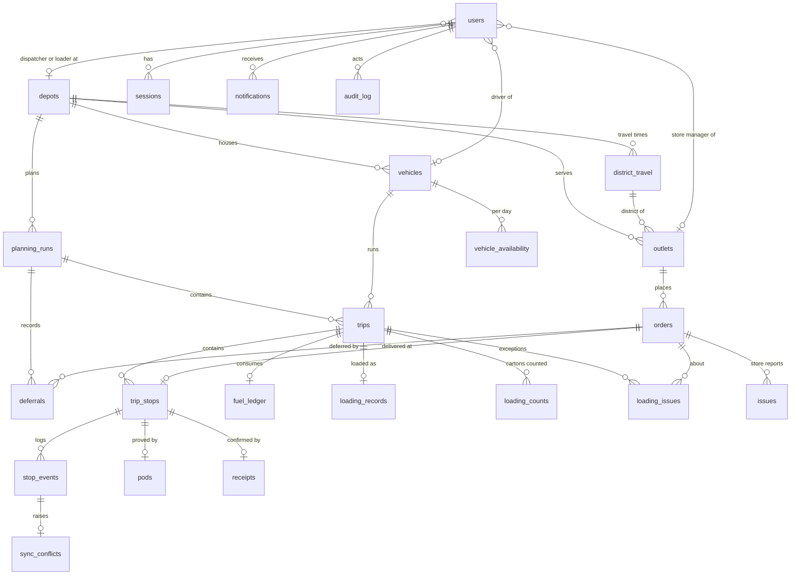

# Data model

PostgreSQL 16, defined with Drizzle in
[packages/database/src/schema](../packages/database/src/schema) and applied by the SQL migrations in
[packages/database/migrations](../packages/database/migrations). Enum values come from the Zod
enums in `packages/shared`, so the database and the API share one vocabulary.

## Entity-relationship diagram

## Tables

| Group | Table | Purpose |
| --- | --- | --- |
| Identity | `users` | One row per account. `role` is `dispatcher`, `loader`, `driver` or `store_manager`; a check constraint allows only that role's scope column (`depot_id`, `vehicle_id` or `outlet_id`). |
| | `sessions` | Server-side sessions with an expiry. |
| Reference | `depots`, `outlets`, `vehicles` | Loaded from the supplied CSVs. Outlets carry brand, dock type, parking constraint and delivery and mall windows; vehicles carry type, temperature, weight and volume capacity and fuel quota. |
| | `district_travel`, `service_allowances`, `calendar_days` | Travel distance and time per district, unloading minutes per brand and dock type, operating days. |
| | `vehicle_availability` | Vehicle status per date (for example, in the workshop). |
| | `demand_history` | Daily demand per depot and brand, aggregated from order history for analytics. |
| Orders | `orders` | One order per outlet, date and temperature: units, weight, volume, `status`, lock time and a `version` for optimistic updates. |
| Planning | `planning_runs` | One run per depot and service date; `status` open or published, `plan_version`. |
| | `trips` | A vehicle's trip 1 or 2 in a run, with `status`, `version`, planned minutes and km. |
| | `trip_stops` | One order on one trip at sequence `seq`, with planned arrival, `status` and a `late` flag. An order is on at most one stop. |
| | `deferrals` | Order, run, reason code, type, note and the acting user. |
| | `fuel_ledger` | Litres per trip against the vehicle's ISO-week quota. |
| | `saved_views` | Saved planning-queue filters, private or shared with the team. |
| Loading | `loading_records` | One per trip: loading status, loader, accepted trip version, verification time. |
| | `loading_counts` | Cartons counted onto the vehicle per trip and order. |
| | `loading_issues` | Shortfall, damage or missing goods, with dispatcher acknowledgement. |
| Delivery | `stop_events` | Arrived, delivered or failed events. `client_event_id` is unique; both `client_time` and `server_time` are kept. |
| | `pods` | Proof of delivery per stop: recipient name, signature image, optional photo. |
| Store | `receipts` | Store manager's confirmation of a delivered stop. |
| | `issues` | Discrepancies reported by the store, with the dispatcher's resolution. |
| Cross-cutting | `notifications` | Per-recipient feed with type, priority, entity link, read and acknowledged times. |
| | `audit_log` | Actor, role, action, entity, before and after JSON, time. |
| | `sync_conflicts` | An offline event that arrived after its stop was changed, kept for review. |
| | `seed_meta` | One row marking the database as seeded, which makes the seed idempotent. |

## Key relationships and rules

- **Scope lives on the user.** A store manager has an `outlet_id`, a loader a `depot_id`, a driver
  a `vehicle_id`. The API adds that value to every orders and trips query, so access control
  follows the data model.
- **Order → stop → evidence.** `trip_stops.order_id` is unique, so an order is delivered by one
  stop. That stop owns the driver's `stop_events`, at most one `pods` row and at most one
  `receipts` row.
- **A plan is a run.** `planning_runs` is unique per depot and service date. Its trips are unique
  per vehicle and trip number, and `trip_no` can only be 1 or 2, which enforces the two-trip limit
  in the database as well as in the validator.
- **Deferral history.** `deferrals` rows are never updated; an order deferred on consecutive runs
  has one row per run, each with its reason and actor.
- **Idempotent sync.** The unique `stop_events.client_event_id` is what makes replaying an offline
  outbox safe. A conflicting event keeps its row and gets a `sync_conflicts` row.
- **Versions.** `orders.version`, `trips.version` and `planning_runs.plan_version` detect stale
  edits; `loading_records.accepted_trip_version` shows whether the loader has seen the latest plan.
- **Database-level integrity.** Check constraints cover positive sizes and capacities, window
  order, publish fields on a run, acknowledgement pairs on loading issues and resolution pairs on
  store issues.
